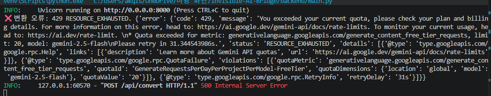

# 바이브 코딩 대회 프로젝트 : Invisible AI-Bridge

[https://github.com/Invisible-AI-Bridge/Invisible-AI-Bridge](https://github.com/Invisible-AI-Bridge/Invisible-AI-Bridge)

# 🌉 Invisible AI-Bridge

---

> 사용자의 개입 없이 비정형 데이터를 AI 최적화 규격(AI-Readable Standard)으로 자동 정규화하여 학습 효율을 극대화하는 **지능형 데이터 가교 플랫폼**
> 

인간의 학습 방식과 AI의 데이터 처리 방식 간의 격차를 줄이기 위해, 비정형 데이터(교안, 필기 등)를 구조화된 지식 인덱스로 변환하여 **할루시네이션(Hallucination)을 억제**하고 **프롬프트 엔지니어링의 피로도를 근본적으로 해결**합니다.

---

## ✨ 핵심 기능 (Core Features)

### 1. Invisible Normalization

Zero-Learning Curve를 지향합니다. 사용자의 추가 입력이나 복잡한 프롬프트 없이 백엔드에서 비정형 데이터를 AI 최적화 규격으로 정규화하여 사용자 경험을 극대화합니다.

### 2. Protocol Conversion

PDF, 텍스트, 학습 로그 등을 **계층형 마크다운(Hierarchical Markdown)** 및 **구조화된 JSON 데이터**로 정규 변환합니다.

### 3. Entity Mapping

데이터 내 핵심 개념 간의 상관관계를 추출하여 AI가 즉각적으로 컨텍스트를 파악할 수 있는 **지식 인덱스**를 구축합니다.

### 4. Context Synchronization

AI가 사용자의 학습 자료를 장기 지식 구조로 완벽히 흡수하여 질문의 추상도와 상관없이 **매끄러운 맥락 유지**를 구현합니다.

---

## 🛠 기술 스택 (Tech Stack)

### Frontend

| 항목 | 내용 |
| --- | --- |
| Framework | Next.js 14 (App Router) |
| Language | TypeScript |
| Styling | Tailwind CSS |

### Backend

| 항목 | 내용 |
| --- | --- |
| Framework | FastAPI (Python 3.10+) |
| AI SDK | `google-genai` (Latest SDK) |
| AI Model | Gemini 2.5 Flash |

---

## ⚙️ 시작하기 (Getting Started)

### 1. 환경 변수 설정

프로젝트 루트 폴더와 `backend/` 폴더에 각각 환경 변수 파일을 생성하세요.

상세 설정은 `.env.example` 파일을 참고하시기 바랍니다.

### 2. 백엔드 서버 실행 (FastAPI)

```bash
cd backend

# 가상환경 생성 및 활성화
python -m venv .venv
source .venv/Scripts/activate  # Windows (Git Bash)
# source .venv/bin/activate    # Mac/Linux

# 의존성 설치
pip install -r requirements.txt

# 서버 실행
python main.py
```

### 3. 프론트엔드 실행 (Next.js)

```bash
# 프로젝트 루트 폴더에서 실행
npm install
npm run dev
```

---

## 📂 프로젝트 구조 (Project Structure)

```
INVISIBLE-AI-BRIDGE/
├── .next/
├── backend/                      # FastAPI 기반 AI 로직 및 데이터 정규화 엔진
│   ├── __pycache__/
│   ├── .venv/
│   ├── .gitignore
│   ├── main.py
│   └── requirements.txt
├── node_modules/
├── public/
│   └── data/
│       └── sample-data.json
│   ├── file.svg
│   ├── globe.svg
│   ├── next.svg
│   ├── vercel.svg
│   └── window.svg
├── src/                          # Next.js 프론트엔드 소스 코드
│   └── app/
│       ├── favicon.ico
│       ├── globals.css
│       ├── layout.tsx
│       └── page.tsx
│   └── components/               # UI 컴포넌트
│       ├── BackendStatus.tsx
│       ├── Converter.tsx
│       ├── Footer.tsx
│       └── Header.tsx
├── .env.local
├── .gitignore
├── AGENTS.md
├── CLAUDE.md
├── eslint.config.mjs
├── next-env.d.ts
├── next-sitemap.config.js
├── next.config.ts
├── package-lock.json
├── package.json
├── postcss.config.mjs
├── README.md
└── tsconfig.json
```

## [main.py](http://main.py) = Gemini, FastAPI 연동 ([normalizer.py](http://normalizer.py) 통합)

> `normalizer.py`의 `normalize_file()` / `merge_complex()`를 직접 import해서 `/api/convert`와 `/api/merge` 엔드포인트에 연결했습니다. 기존의 직접 Gemini 호출 로직은 모두 `normalizer.py`로 위임됩니다.
> 

```python
import os
import tempfile
from pathlib import Path
from typing import List

from fastapi import FastAPI, UploadFile, File, Form, HTTPException
from pydantic import BaseModel
from dotenv import load_dotenv

# ★ normalizer.py에서 핵심 로직 import
from normalizer import normalize_file, merge_complex

load_dotenv(dotenv_path="../.env.local")

app = FastAPI()

# ──────────────────────────────────────────
# 공통 모델
# ──────────────────────────────────────────
class MergeRequest(BaseModel):
    teacher_md: str   # 정규화된 교안 마크다운
    student_md: str   # 정규화된 필기 마크다운
    topic: str = "학습 자료"

class ChatMessage(BaseModel):
    role: str
    content: str

class ChatRequest(BaseModel):
    messages: List[ChatMessage]

# ──────────────────────────────────────────
# 헬스체크
# ──────────────────────────────────────────
@app.get("/api/health")
async def health_check():
    return {"status": "ok", "message": "Invisible AI-Bridge 백엔드 정상 작동 중"}

# ──────────────────────────────────────────
# /api/convert  ← normalizer.normalize_file() 연동
# data_type Form 파라미터: '교안' | '필기' | '복합' (기본값: '복합')
# ──────────────────────────────────────────
@app.post("/api/convert")
async def convert_file(
    file: UploadFile = File(...),
    data_type: str = Form(default="복합"),
):
    filename = file.filename
    contents = await file.read()

    # 허용 파일 형식 검증
    ALLOWED = {".txt", ".pdf", ".png", ".jpg", ".jpeg"}
    suffix = Path(filename).suffix.lower()
    if suffix not in ALLOWED:
        raise HTTPException(status_code=400, detail=f"지원하지 않는 파일 형식: {suffix}")

    # 허용 data_type 검증
    if data_type not in ("교안", "필기", "복합"):
        raise HTTPException(status_code=400, detail="data_type은 '교안', '필기', '복합' 중 하나여야 합니다.")

    tmp_path = None
    try:
        # 임시 파일로 저장 후 normalizer에 경로 전달
        with tempfile.NamedTemporaryFile(suffix=suffix, delete=False) as tmp:
            tmp.write(contents)
            tmp_path = tmp.name

        # ★ normalizer.py의 핵심 로직 호출
        result = normalize_file(tmp_path, data_type=data_type)

        return {
            "title": filename,
            "data_type": result["data_type"],
            "weight": result["weight"],
            "normalized_markdown": result["normalized_markdown"],
            "output_path": result["output_path"],
        }
    except Exception as e:
        raise HTTPException(status_code=500, detail=f"정규화 중 오류 발생: {str(e)}")
    finally:
        if tmp_path:
            Path(tmp_path).unlink(missing_ok=True)

# ──────────────────────────────────────────
# /api/merge  ← normalizer.merge_complex() 연동
# 교안 + 필기 정규화 결과를 병합해 복합 지식 인덱스 생성
# ──────────────────────────────────────────
@app.post("/api/merge")
async def merge_documents(req: MergeRequest):
    try:
        # ★ normalizer.py의 병합 로직 호출
        merged_md = merge_complex(
            teacher_md=req.teacher_md,
            student_md=req.student_md,
            topic=req.topic,
        )
        return {
            "topic": req.topic,
            "merged_markdown": merged_md,
        }
    except Exception as e:
        raise HTTPException(status_code=500, detail=f"병합 중 오류 발생: {str(e)}")

# ──────────────────────────────────────────
# /api/chat  (v2 예정 — 현재는 stub)
# ──────────────────────────────────────────
@app.post("/api/chat")
async def chat_endpoint(request: ChatRequest):
    # v2에서 normalizer 출력물을 컨텍스트로 활용한 챗봇 연동 예정
    return {"role": "assistant", "content": "챗봇 기능은 v2에서 지원 예정입니다."}

if __name__ == "__main__":
    import uvicorn
    uvicorn.run(app, host="0.0.0.0", port=8000)
```

### 기존 [main.py](http://main.py) vs 연동 후 변경 사항

| 항목 | 기존 [main.py](http://main.py) | 연동 후 [main.py](http://main.py) |
| --- | --- | --- |
| Gemini 호출 위치 | [main.py](http://main.py) 내부에서 직접 호출 | [normalizer.py](http://normalizer.py)에 완전 위임 |
| /api/convert | 텍스트 파일만 처리, 단순 프롬프트 | normalize_file(tmp_path, data_type) 호출 |
| data_type 파라미터 | 없음 | Form 파라미터로 '교안' / '필기' / '복합' 선택 가능 |
| /api/merge | 없음 | merge_complex() 호출해 교안+필기 병합 |
| /api/chat | 직접 Gemini 호출 | v2 stub으로 전환 (실제 로직은 v2에서 연동) |

### 파일 배치 구조

```
backend/
├── main.py          # FastAPI 라우터 (엔드포인트 정의)
├── normalizer.py    # 핵심 정규화 엔진 (Gemini 호출 + 변환 로직)
├── output/          # 정규화 결과 .md 파일 저장 폴더 (자동 생성)
└── requirements.txt
```

### API 흐름 요약

```
[프론트엔드]
  ↓ POST /api/convert  { file, data_type }
[main.py]
  ↓ normalize_file(tmp_path, data_type)
[normalizer.py]  ← Gemini 2.5 Flash 호출
  ↓ { normalized_markdown, weight, output_path }
[main.py]
  ↓ JSON 응답 반환
[프론트엔드]

[프론트엔드]
  ↓ POST /api/merge  { teacher_md, student_md, topic }
[main.py]
  ↓ merge_complex(teacher_md, student_md, topic)
[normalizer.py]  ← Gemini 2.5 Flash 호출
  ↓ merged_markdown
[main.py]
  ↓ JSON 응답 반환
[프론트엔드]
```

---

## 📋 AI 최적화 자료 변환 표준 (Conversion Standard)

### 1. 데이터 타입별 변환 Standard & 가중치

AI가 자료의 성격에 따라 리소스를 다르게 배분할 수 있도록 **Span(청킹 단위)**과 가중치를 차등 적용합니다.

| 자료 유형 | 추천 Span(청킹) 구조 | 가중치 | 핵심 변환 로직 |
| --- | --- | --- | --- |
| 선생님 교안 | 대형 (개념/단원 단위) | 1.0 | 목차(#) 기반의 지식 뼈대 구축 |
| 학생 필기 | 소형 (문장/라인 단위) | 0.5 | 개인별 키워드 및 이해도 파악 |
| 복합 자료 | 중형 (영역 매핑 단위) | 0.8 | 교안과 필기 간의 인과관계 연결 |

### 2. 비정형 데이터(이미지/도표) 처리 방안

단순한 OCR을 넘어 AI가 맥락을 이해할 수 있는 형태로 변환합니다.

- **도표 (Table)**
    - **Standard**: `Markdown Table` 포맷으로 변환
        - **보강**: 표 상단에 해당 표의 목적을 설명하는 **Semantic Summary** 한 줄 삽입
- **이미지 (Diagram)**
    - **Standard**: Gemini Vision 기능을 이용해 **고밀도 텍스트 캡션(ALT-Text)**으로 변환
    - **매핑**: 이미지 내 특정 좌표와 그 주변 텍스트/필기를 1:1로 매핑하여 저장

### 3. 토큰 사용량 최적화 (Cost-Effective) 전략

성능은 유지하면서 운영 비용을 획기적으로 낮추는 3단계 다이어트 로직입니다.

1. **Vision-to-Text Compression**: 이미지는 변환 단계에서 딱 한 번만 텍스트로 캡셔닝하여 저장 (이후 대화에서 이미지 재전송 없음)
2. **2단계 하이브리드 검색**: 질문과 관련된 핵심 Span만 Vector Search로 선별한 뒤, 최소한의 데이터만 Gemini API에 전달
3. **Compact Markdown**: 불필요한 공백, 서식, 중복 코드를 제거하여 순수 정보 밀도가 높은 마크다운 형식 유지

### 4. 기대 효과 (The Conclusion)

이 표준을 준수할 경우 다음과 같은 성능을 보장합니다.

- **선생님**: 본인의 교안이 AI 지식과 결합하여 자동으로 고도화된 수업 리포트 생성
- **학생**: 자신의 필기 맥락이 반영된 초개인화된 맞춤형 학습 출력물 수령
- **상호작용**: 클래스별 서버 분리를 통해 선생님의 교수 의도와 학생의 학습 성취도가 실시간으로 피드백되는 지능형 생태계 구현

---

## 🚀 변환 표준 실행 코드 (Standard Implementation)

> PDF에 정의된 **데이터 타입별 가중치**, **비정형 데이터 처리**, **토큰 최적화** 3가지 전략을 모두 반영한 실제 실행 코드입니다.
> 

### [normalizer.py](http://normalizer.py) — 핵심 정규화 엔진

```python
import os
import re
from pathlib import Path
from google import genai
from google.genai import types
from dotenv import load_dotenv

load_dotenv(dotenv_path="../.env.local")

client = genai.Client(api_key=os.getenv("GEMINI_API_KEY"))
MODEL = "gemini-2.5-flash"
OUTPUT_DIR = Path("output")
OUTPUT_DIR.mkdir(exist_ok=True)

# ──────────────────────────────────────────
# 1. 데이터 타입별 Span & 가중치 정의
# ──────────────────────────────────────────
DATA_TYPE_CONFIG = {
    "교안": {
        "span": "large",       # 개념/단원 단위
        "weight": 1.0,
        "chunk_hint": "각 단원(#, ##)을 하나의 청크로 유지하세요.",
    },
    "필기": {
        "span": "small",       # 문장/라인 단위
        "weight": 0.5,
        "chunk_hint": "각 문장 또는 키워드 단위로 분리하세요.",
    },
    "복합": {
        "span": "medium",      # 영역 매핑 단위
        "weight": 0.8,
        "chunk_hint": "교안 구조를 골격으로, 필기 내용을 하위 항목으로 연결하세요.",
    },
}

# ──────────────────────────────────────────
# 2. 자료 유형별 프롬프트 생성
# ──────────────────────────────────────────
def build_prompt(data_type: str, filename: str, text: str = "") -> str:
    cfg = DATA_TYPE_CONFIG.get(data_type, DATA_TYPE_CONFIG["복합"])
    return f"""당신은 교육 자료 전문 AI 정규화 엔진입니다.
아래 [원본 자료]를 분석하여 AI가 처리하기 최적화된 '계층형 마크다운(Hierarchical Markdown)'으로 변환해주세요.

[자료 유형: {data_type} | 가중치: {cfg['weight']} | Span: {cfg['span']}]
[청킹 전략] {cfg['chunk_hint']}

[변환 규칙]
1. 제목 계층(#, ##, ###)을 활용해 지식 뼈대를 구축하세요.
2. 표(Table)는 반드시 Markdown Table 포맷으로 변환하고,
   표 바로 위에 "[표 요약]: <이 표의 목적 한 줄>" 형태로 Semantic Summary를 삽입하세요.
3. 이미지나 도표가 언급되면 고밀도 ALT-Text로 설명하세요.
   형식: "[이미지 설명]: <구체적인 시각 정보>"
4. 불필요한 공백·중복 문장·서식 기호는 제거하여 토큰 밀도를 높이세요 (Compact Markdown).
5. 원본에 없는 내용을 추가하거나 사실을 변형하지 마세요 (Hallucination 금지).
6. 출력은 반드시 마크다운 형식만 사용하세요.

[원본 자료 — {filename}]
{text if text else '(멀티모달 파일: 직접 분석)'}
"""

# ──────────────────────────────────────────
# 3. Compact Markdown 후처리 (토큰 최적화)
# ──────────────────────────────────────────
def compact_markdown(text: str) -> str:
    """불필요한 공백·연속 줄바꿈·중복 코드펜스를 제거해 토큰 밀도를 높입니다."""
    text = re.sub(r'\n{3,}', '\n\n', text)       # 3줄 이상 빈 줄 → 2줄로
    text = re.sub(r'[ \t]+$', '', text, flags=re.MULTILINE)  # 줄 끝 공백 제거
    text = re.sub(r'^(```\w*)\n\1$', r'\1', text, flags=re.MULTILINE)  # 빈 코드블록 제거
    return text.strip()

# ──────────────────────────────────────────
# 4. 파일 타입 감지 및 정규화 실행
# ──────────────────────────────────────────
def normalize_file(filepath: str, data_type: str = "복합") -> dict:
    """
    파일을 읽어 AI 최적화 마크다운으로 정규화합니다.

    Args:
        filepath: 변환할 파일 경로 (.txt / .pdf / .png / .jpg)
        data_type: '교안' | '필기' | '복합' (기본값: '복합')

    Returns:
        {
            'data_type': str,
            'weight': float,
            'normalized_markdown': str,
            'output_path': str,
        }
    """
    path = Path(filepath)
    filename = path.name
    suffix = path.suffix.lower()
    contents = path.read_bytes()

    # Vision-to-Text Compression: 이미지/PDF는 Gemini에 직접 전달 (재전송 방지용 1회 캡셔닝)
    MULTIMODAL_TYPES = {
        ".pdf": "application/pdf",
        ".png": "image/png",
        ".jpg": "image/jpeg",
        ".jpeg": "image/jpeg",
    }

    prompt_text = build_prompt(data_type, filename)

    if suffix in MULTIMODAL_TYPES:
        # 멀티모달: 파일 바이트를 직접 전달
        response = client.models.generate_content(
            model=MODEL,
            contents=[
                prompt_text,
                types.Part.from_bytes(data=contents, mime_type=MULTIMODAL_TYPES[suffix]),
            ],
        )
    else:
        # 텍스트 기반: 내용 디코딩 후 프롬프트에 포함
        text_content = contents.decode("utf-8", errors="ignore")
        prompt_text = build_prompt(data_type, filename, text_content)
        response = client.models.generate_content(
            model=MODEL,
            contents=prompt_text,
        )

    # Compact Markdown 후처리
    normalized = compact_markdown(response.text)

    # 결과 저장
    output_path = OUTPUT_DIR / f"{path.stem}_normalized.md"
    output_path.write_text(normalized, encoding="utf-8")
    print(f"[완료] {output_path} 저장됨")

    return {
        "data_type": data_type,
        "weight": DATA_TYPE_CONFIG.get(data_type, {}).get("weight", 0.8),
        "normalized_markdown": normalized,
        "output_path": str(output_path),
    }

# ──────────────────────────────────────────
# 5. 복합 자료 병합 (교안 + 필기 인과관계 연결)
# ──────────────────────────────────────────
def merge_complex(teacher_md: str, student_md: str, topic: str = "학습 자료") -> str:
    """
    교안(가중치 1.0)과 학생 필기(가중치 0.5)를 병합하여
    인과관계가 연결된 복합 지식 인덱스를 생성합니다.
    """
    prompt = f"""당신은 교육 데이터 통합 전문가입니다.
아래 [교안]과 [학생 필기]를 분석하여 두 자료의 인과관계를 연결한 통합 지식 인덱스를 생성해주세요.

[통합 규칙]
- 교안의 개념 구조를 골격(뼈대)으로 사용하세요.
- 학생 필기의 핵심 키워드와 이해 포인트를 교안 항목 하위에 연결하세요.
- 교안에 없는 필기 내용은 "[학생 보충]" 태그로 구분하세요.
- 출력은 Compact Markdown 형식으로 토큰 낭비 없이 작성하세요.

[주제: {topic}]

## 교안 (가중치 1.0)
{teacher_md}

## 학생 필기 (가중치 0.5)
{student_md}
"""
    response = client.models.generate_content(model=MODEL, contents=prompt)
    merged = compact_markdown(response.text)

    output_path = OUTPUT_DIR / f"{topic.replace(' ', '_')}_merged.md"
    output_path.write_text(merged, encoding="utf-8")
    print(f"[병합 완료] {output_path} 저장됨")
    return merged

# ──────────────────────────────────────────
# 실행 예시
# ──────────────────────────────────────────
if __name__ == "__main__":
    # 단일 파일 정규화
    result = normalize_file("samples/lecture_notes.pdf", data_type="교안")
    print(f"\n가중치: {result['weight']}")
    print(result["normalized_markdown"][:500])

    # 교안 + 필기 복합 병합
    teacher = Path("output/lecture_notes_normalized.md").read_text(encoding="utf-8")
    student = normalize_file("samples/student_notes.txt", data_type="필기")["normalized_markdown"]
    merged_index = merge_complex(teacher, student, topic="파이썬 기초")
    print("\n[복합 지식 인덱스 미리보기]")
    print(merged_index[:500])
```

### requirements.txt 추가 항목

```
google-genai
python-dotenv
```

---

## 🧠 Gemini CLI 프로젝트 컨텍스트 프롬프트

> Gemini CLI 실행 시 아래 프롬프트를 복사해서 전달하면 프로젝트 전체 컨텍스트를 AI가 바로 파악합니다.
> 

```
당신은 '바이브 코딩 대회' 프로젝트의 AI 코딩 어시스턴트입니다.
이후 제가 코드를 더드리거나 추가를 요청할 때, 아래 프로젝트 전체 구조를 기준으로 답해주세요.

==== 프로젝트 개요 ====

프로젝트명: Invisible AI-Bridge
목표: 사용자의 개입 없이 비정형 데이터(PDF, 텍스트, 이미지)를 AI 최적화 규격(AI-Readable Standard)으로 자동 정규화하는 지능형 데이터 가교 플랫폼.
협동: 할루시네이션(Hallucination) 억제, 프롬프트 엔지니어링 피로도 근본 해결

==== 기술 스택 ====

프론트엔드: Next.js 14 (App Router) + TypeScript + Tailwind CSS
백엔드: FastAPI (Python 3.10+) + google-genai SDK + Gemini 2.5 Flash

==== 파일 구조 ====

backend/
├── main.py        ← FastAPI 라우터 (엔드포인트만 정의, Gemini 미호출)
├── normalizer.py  ← 핵심 정규화 엔진 (모든 Gemini 호출 + 변환 로직 집중)
├── output/        ← 정규화 .md 결과 저장 폴더 (자동 생성)
└── requirements.txt

src/ (Next.js)
├── app/page.tsx
└── components/
    ├── Converter.tsx   ← 파일 업로드 + data_type 선택 UI
    ├── BackendStatus.tsx
    ├── Header.tsx
    └── Footer.tsx

==== API 엔드포인트 ====

GET  /api/health
  → 백엔드 상태 확인

POST /api/convert
  입력: file (UploadFile), data_type (Form: '교안' | '필기' | '복합')
  동작: normalizer.normalize_file() 호출 → 정규화 .md 저장
  출력: { title, data_type, weight, normalized_markdown, output_path }

POST /api/merge
  입력: teacher_md (str), student_md (str), topic (str)
  동작: normalizer.merge_complex() 호출 → 교안+필기 병합 .md 저장
  출력: { topic, merged_markdown }

POST /api/chat
  상태: v2 예정 (stub 보유 중)

==== normalizer.py 핵심 로직 ====

● DATA_TYPE_CONFIG: 자료 유형별 Span/가중치 정의
  - '교안': span=large, weight=1.0  (개념/단원 단위 청킹)
  - '필기': span=small, weight=0.5  (문장/라인 단위 청킹)
  - '복합': span=medium, weight=0.8 (영역 매핑 단위 청킹)

● build_prompt(): 자료 유형별 Gemini 프롬프트 생성
  - 표 변환 시 Semantic Summary 삽입 규칙 포함
  - 이미지는 고밀도 ALT-Text 방식으로 변환
  - Hallucination 금지 규칙 포함

● compact_markdown(): 불필요 공백/중복 제거 후처리 (토큰 최적화)

● normalize_file(filepath, data_type):
  - .txt → 텍스트 디코딩 후 프롬프트 삽입
  - .pdf/.png/.jpg → Vision-to-Text Compression (Gemini에 바이트 직접 전달, 1회만 청킹)
  - 결과를 output/{stem}_normalized.md에 저장

● merge_complex(teacher_md, student_md, topic):
  - 교안(구조 뼈대) + 필기(키워드) 연결
  - 교안 외 필기 내용은 ['학생 보충'] 태그로 구분
  - 결과를 output/{topic}_merged.md에 저장

==== 토큰 사용량 최적화 전략 ====

1. Vision-to-Text Compression: 이미지/PDF는 변환 시 1회만 Gemini에 전달해 쾐셔닝, 이후는 텍스트만 사용
2. 2단계 하이브리드 검색: 핵심 Span만 Vector Search로 선별 후 최소 데이터만 API에 전달
3. Compact Markdown: 불필요 공백·서식·중복 코드제거 후 스트리핑

==== v1 vs v2 로드맵 ====

v1 (hyunJae): 비정형 데이터 → 계층형 마크다운/JSON 정규화 파이프라인 완성
v2 (향후): 정규화된 지식 인덱스 기반 AI 챗봇 연동

==== 환경 변수 ====

.env.local 위치: 프로젝트 루트 및 backend/ 폴더
GEMINI_API_KEY=<사용자 키>

==== 주의사항 ====

- normalizer.py를 수정할 때는 DATA_TYPE_CONFIG를 먼저 확인하세요.
- main.py는 라우팅만 담당하며, Gemini 호출 코드를 main.py에 직접 작성하지 마세요.
- 리스폰스 JSON에는 raw_text, hallucination_reduction 같은 시뮬레이션 필드를 넘기지 마세요. 실제 정규화 결과만 반환합니다.
```

---

## 💬 챗봇 (향후 버전업 예정)

> **현재 상태:** 챗봇 기능 코드 구현은 완료되어 있으나, **v1 범위에서 제외**합니다.
> 

### 보류 이유

본 프로젝트의 궁극적인 목표는 **비정형 데이터를 AI 최적화 규격으로 자동 정규화하는 것**입니다.

챗봇은 정규화된 데이터를 '활용'하는 레이어로, 실시간 상호작용보다 **데이터 변환 파이프라인의 완성도**를 먼저 확보하는 것이 우선순위입니다.

- ✅ v1 목표: 비정형 데이터 → 계층형 마크다운/JSON 정규화 파이프라인
- 🔜 v2 예정: 정규화된 지식 인덱스를 기반으로 한 AI 챗봇 연동

### 예제 코드 (Python — 향후 챗봇 연동 시 참고)

아래는 정규화된 데이터를 컨텍스트로 삼아 Gemini와 대화하는 기본 구조입니다.

```python
import os
from google import genai
from google.genai import types
from dotenv import load_dotenv

load_dotenv(dotenv_path="../.env.local")

client = genai.Client(api_key=os.getenv("GEMINI_API_KEY"))
MODEL = "gemini-2.5-flash"

def load_normalized_context(filepath: str) -> str:
    """정규화된 마크다운 파일을 시스템 컨텍스트로 로드합니다."""
    with open(filepath, "r", encoding="utf-8") as f:
        return f.read()

def chat_with_context(user_question: str, context: str) -> str:
    """
    정규화된 지식 베이스를 컨텍스트로 활용하여 질문에 답합니다.
    할루시네이션 억제를 위해 컨텍스트 외 정보는 사용하지 않도록 지시합니다.
    """
    system_prompt = f"""당신은 아래 [지식 베이스]만을 기반으로 질문에 답하는 AI 어시스턴트입니다.
[지식 베이스] 외의 정보는 절대 사용하지 마세요. 모르는 내용은 '제공된 자료에 없습니다'라고 답하세요.

[지식 베이스]
{context}
"""
    response = client.models.generate_content(
        model=MODEL,
        contents=[
            types.Content(role="user", parts=[types.Part(text=system_prompt + f"\n\n질문: {user_question}")])
        ]
    )
    return response.text

# --- 사용 예시 ---
if __name__ == "__main__":
    # 1. 정규화된 데이터 로드 (v1 파이프라인의 출력물)
    normalized_context = load_normalized_context("output/normalized.md")

    # 2. 컨텍스트 기반 Q&A
    questions = [
        "이 자료의 핵심 개념을 3가지로 요약해줘.",
        "관련 용어들 사이의 관계를 설명해줘.",
    ]
    for q in questions:
        print(f"Q: {q}")
        print(f"A: {chat_with_context(q, normalized_context)}\n")
```

> 💡 **설계 포인트:** 챗봇이 자체 학습 데이터나 인터넷 지식이 아닌, **v1에서 정규화된 결과물만을 근거**로 답하도록 강제함으로써 할루시네이션을 구조적으로 억제합니다.
> 

## 오류 현상

### 오류 1. CORS 차단

**발생 위치:** 브라우저 콘솔

```
Access to fetch at 'http://127.0.0.1:8000/api/convert' from origin 'http://localhost:3000'
has been blocked by CORS policy: No 'Access-Control-Allow-Origin' header is present.
```

**원인**

Next.js 프론트엔드(`localhost:3000`)가 FastAPI 백엔드(`127.0.0.1:8000`)로 요청을 보낼 때, FastAPI에 **CORS 허용 설정이 없어서** 브라우저가 요청 자체를 차단합니다.

**해결 방법** — `main.py`에 `CORSMiddleware` 추가

```python
from fastapi.middleware.cors import CORSMiddleware

app.add_middleware(
    CORSMiddleware,
    allow_origins=["http://localhost:3000"],
    allow_credentials=True,
    allow_methods=["*"],
    allow_headers=["*"],
)
```

---

### 오류 2. 429 RESOURCE_EXHAUSTED — ⚠️ **무료** API 한도 초과

**발생 위치:** 브라우저 알림 + 백엔드 터미널

```
변환 오류: 429 RESOURCE_EXHAUSTED.
Quota exceeded for metric: generativelanguage.googleapis.com/generate_content_free_tier_requests
limit: 20, model: gemini-2.5-flash
Please retry in 30s.
```

**원인**

Gemini API **무료 티어**의 `gemini-2.5-flash` 모델 요청 한도를 초과했습니다.

이는 **무료 플랜의 구조적 한계**로, 잧은 시간에 여러 번 변환 요청을 보내면 반드시 발생합니다.

> 🚨 **무료 티어 한도 (2025 기준)**
gemini-2.5-flash: **분당 10~20 RPM** (무료), 일일 500회 제한
초과 시 **무료 플랜**에서는 30초~수 분 대기 후 재시도만 가능
> 

**해결 방법 (단기)**

30초 대기 후 다시 시도하면 정상 작동합니다.

**해결 방법 (근본적)**

- **방법 A — 재시도 로직 추가** (`normalizer.py`)

```python
import time

def normalize_file_with_retry(filepath: str, data_type: str = "복합", max_retries: int = 3) -> dict:
    for attempt in range(max_retries):
        try:
            return normalize_file(filepath, data_type)
        except Exception as e:
            if "429" in str(e) or "RESOURCE_EXHAUSTED" in str(e):
                wait = 30 * (attempt + 1)  # 30초, 60초, 90초
                print(f"[무료 한도 초과] {wait}초 후 재시도... ({attempt+1}/{max_retries})")
                time.sleep(wait)
            else:
                raise
    raise RuntimeError("최대 재시도 횟수 초과")
```

- **방법 B — 유료 플랜 업그레이드(강추)**
    - Google AI Studio → [https://ai.google.dev/pricing](https://ai.google.dev/pricing)
    - Pay-as-you-go 전환 시 **분당 1,000 RPM 이상** 가능 (무료 대비 50배 이상)
    - **⚠️ 무료 키로 대회 데모를 진행하면 한도가 보장되지 않습니다. 유료 플랜 또는 키 여러 개를 반드시 준비하세요.**
- **방법 C — API 키 분산** (임시 방편)
    - `.env.local`에 키를 여러 개 등록 후 라운드로빈 방식으로 교체

---

### 오류 3. 500 Internal Server Error (연쇄 오류)

**원인**

위의 429 오류가 백엔드에서 예외 처리 없이 그대로 올라와 FastAPI가 500으로 응답합니다. `normalize_file()` 내부에서 Gemini 오류가 염과되기 때문입니다.

**해결 방법** — `main.py`에서 429 전용 에러 메시지 분기

```python
except Exception as e:
    err = str(e)
    if "429" in err or "RESOURCE_EXHAUSTED" in err:
        raise HTTPException(
            status_code=429,
            detail="[무료 API 한도 초과] 잠시 후 다시 시도해주세요. (약 30초 대기)"
        )
    raise HTTPException(status_code=500, detail=f"정규화 중 오류 발생: {err}")
```




# ✅ 구현 성공 시

## 화면 구성

성공 시 **Invisible AI-Bridge** 프론트엔드는 다음 3가지 영역으로 구성됩니다.

**① 좌측 사이드 (Upload Panel)**

- **자료 유형 선택 탭**: `교안` / `필기` / `복합` 중 하나 선택
- **파일 업로드 영역**: `.txt`, `.pdf`, `.png`, `.jpg` 등 드래그 & 드롭 또는 클릭으로 입력
- **업로드된 파일명**이 아이콘과 함께 패널 하단에 표시

**② 중앙 실행 버튼**

- 파일 선택 후 원형 화살표 **실행 버튼**을 누르면 `/api/convert` 호출 시작
- 정규화 완료되면 우측 결과 리포트로 자동 전환

**③ 우측 결과 리포트 (Result Report)**

- **WEIGHT 버지**: 자료 유형별 가중치 표시 (`WEIGHT: 1.0` = 교안, `0.5` = 필기, `0.8` = 복합)
- **파일명 표시**: 업로드한 원본 파일명 표시
- **정규화 결과물**: Gemini가 반환한 계층형 마크다운이 렌더링된 형태로 출력
    - `#`, `##`, `###` 제목 위계로 콘텐츠 구조화
    - 표(아진 Markdown Table)는 Semantic Summary 포함
    - 이미지/도표는 ALT-Text 그룹으로 변환
    - Compact Markdown 후처리 적용돼 불필요 공백 제거

## 상단 네비게이션 구조

- **Home**: 프로젝트 소개 페이지
- **About**: Invisible AI-Bridge 컨셉 소개
- **Docs**: API 운용 문서
- **단일 정규화 탭**: 파일 1개를 업로드해 AI 최적화 마크다운으로 변환
- **자료 병합 (Merge) 탭**: 교안 + 필기 두 파일을 업로드해 복합 지식 인덱스로 병합

## 정규화 파이프라인 흐름 (성공 기준)

```
[사용자] 파일 업로드 + 자료 유형 선택
   ↓
[프론트엔드] POST /api/convert { file, data_type }
   ↓
[main.py] 임시 파일 저장 후 normalizer.normalize_file() 호출
   ↓
[normalizer.py] Gemini 2.5 Flash 호출
   ↓ [결과]
   - 가중치(weight) 반환
   - 계층형 마크다운 정규화 완료
   - output/{filename}_normalized.md 저장
   ↓
[프론트엔드] 결과 리포트 UI 렌더링
[사용자] 렌더링된 정규화 결과물 확인 ✓
```


[[README.md](http://README.md)](README%20md%209bf2f8863ac749f08878c14fecb5b47b.md)
